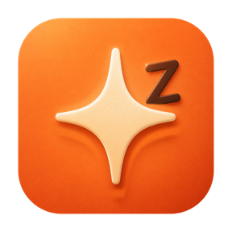

<p align="right">
  <a href="README_EN.md">English</a> ·
  <a href="CHANGELOG.md">更新日志</a>
</p>

<p align="center">
  
</p>

<h1 align="center">AgentAwake</h1>

<p align="center">
  让 Agent 持续工作，让 Mac 在任务结束后照常休息。
</p>

<p align="center">
  macOS 13+ · Apple Silicon / Intel · 当前版本 0.5.0
</p>

<p align="center">
  <a href="https://github.com/Raymond711xl/AgentAwake/releases/latest">下载最新版本</a>
</p>

## 软件介绍

AgentAwake 是一个下载后即可使用的轻量 macOS 菜单栏工具。
当定时保护开启或 Agent 正在工作时，它通过带超时保护的 macOS IOKit
临时电源断言阻止空闲休眠；任务结束、倒计时结束、手动关闭或退出 App 后，
它会立即释放断言，把休眠控制权交还给系统。

它不会调用 `pmset`，不会修改系统的休眠、锁屏或显示器设置，也不会启动常驻的
`caffeinate` 或 shell 子进程。

当前开发版已经建立“自动检测（无需配置）”和“精确跟踪（按 Agent 配置）”两个
层级，并将旧的高频轮询替换为低资源事件驱动。下一步会逐个加入经过验证的第三方
适配器；详见 [Agent 活动检测路线图](docs/AGENT_ACTIVITY_DETECTION_PLAN.md)。
AgentAwake 不会读取提示词、响应正文、Token 明细或 API 密钥。

## 核心功能

- **五档一体式滑轨**：未开启、30 分钟、1 小时、2 小时和 Agent 模式；
  滑轨同时承担选择与开关，不需要额外的启用按钮。
- **Agent 感知保护**：识别本机正在运行的 Codex 与 Claude 任务，只在任务活跃时
  保持系统和显示器唤醒。
- **Hooks 优先、日志兜底**：优先使用生命周期 Hooks 获取及时状态；未安装 Hooks
  时，自动增量读取本地任务日志作为零配置兜底，不依赖可能长期常驻的进程名。
- **事件驱动、缓存有界**：Agent 模式复用一个 macOS 原生文件事件流，只读取新增
  字节；每 15 分钟低频校准，会话和解析缓冲区都有固定上限。
- **通用 Bridge**：能运行生命周期命令的第三方 Agent 可发送 `start`、
  `heartbeat`、`stop`；一次性 helper 写入本地状态后立即退出。
- **下载后直接使用**：普通用户不需要 Codex、Claude、Xcode、Swift 或终端；
  Hooks 与登录项等增强能力都在设置中按需启用。
- **自动释放与续租**：Agent 模式使用 120 秒短租约，每 60 秒续期；最后一个
  Agent 结束 5 秒后自动释放，异常失联的状态也会过期。
- **安全的临时断言**：固定时长和 Agent 模式均使用带超时的 IOKit 断言，
  App 异常中止时也不会永久改写系统配置。
- **清晰的菜单栏状态**：显示当前模式、倒计时、等待状态和正在工作的 Agent；
  每次启动默认回到“未开启”，不会悄悄恢复上一次的接管状态。
- **本地、轻量、无账号**：无网络服务、无登录；未开启时不扫描 Agent，
  不保留计时器，也不持有电源断言。

## 工作模式

| 模式 | 行为 | 自动结束 |
| --- | --- | --- |
| 未开启 | 使用 macOS 原有设置；不扫描、不计时、不持有断言 | — |
| 30 分钟 | 立即保持系统与显示器唤醒 | 30 分钟后释放并回到“未开启” |
| 1 小时 | 立即保持系统与显示器唤醒 | 1 小时后释放并回到“未开启” |
| 2 小时 | 立即保持系统与显示器唤醒 | 2 小时后释放并回到“未开启” |
| Agent | 没有任务时只监听；Codex 或 Claude 工作时临时保持唤醒 | 任务结束后释放，但继续留在 Agent 模式等待下一次任务 |

## 系统要求

- macOS 13 Ventura 或更高版本
- 支持 Apple Silicon 与 Intel Mac
- 当前菜单栏界面为简体中文

## 使用方法

### 1. 下载并启动

前往 [GitHub Releases](https://github.com/Raymond711xl/AgentAwake/releases/latest)：

1. 按本机芯片下载对应文件：
   - M1、M2、M3、M4 等苹果芯片：`AgentAwake-x.y.z-Apple-Silicon.dmg`；
   - Intel 芯片：`AgentAwake-x.y.z-Intel.dmg`。
2. 双击 DMG，在打开的窗口中双击 `AgentAwake.app` 即可使用；如果准备长期使用，
   建议先将 App 拖入“应用程序”，尤其是在启用“登录时启动”前。

如果不知道芯片类型，点击苹果菜单  →“关于本机”，查看“芯片”或“处理器”。

> **首次打开被 macOS 阻止时：**先尝试双击一次并关闭提示，然后打开
> “系统设置 → 隐私与安全性”，向下滚动，在 AgentAwake 提示旁点击“仍要打开”，
> 再确认“打开”（可能需要输入登录密码）。这只需操作一次，以后可以直接双击。
> 本版本采用 ad-hoc 签名，因此不会显示已验证的 Apple 开发者身份；不需要终端命令。

首次启动后，AgentAwake 会自动展开一次菜单栏面板，之后只保留菜单栏图标，
不显示 Dock 图标。三个定时模式此时已经可以使用，不需要继续配置。

### 2. 选择保护模式

1. 点击菜单栏中的四角十字星与单个 `Z` 图标。
2. 拖动滑块选择 30 分钟、1 小时、2 小时或 Agent。
3. 需要立即停止时，把滑块拖回“未开启”；临时断言会马上释放。

固定时长模式会立即开始倒计时。Agent 模式在没有任务时只等待，
检测到 Codex 或 Claude 工作后才接管休眠。

### 3. 可选设置

点击菜单栏面板底部的“设置”，可以按需管理：

- 登录时启动；
- Codex Hooks；
- Claude Hooks；
- 自定义 Agent Bridge。

Agent 模式默认读取本机已有的 Codex 与 Claude 活动记录，因此 Hooks 不是使用
前置条件。设置页会标明本机检测状态，只允许为实际存在的 Agent 安装 Hooks，
不会为未安装的软件创建配置。
AgentAwake 不负责安装或运行大模型；相关 Agent 由用户自行配置，App 只读取
已有的本地状态。
用户明确点击安装后，App 才会：

- 把一次性 Hook helper 安装到
  `~/Library/Application Support/AgentAwake/bin/AgentAwakeHook`；
- 安全合并 `~/.codex/hooks.json` 与 `~/.claude/settings.json`；
- 首次修改已有配置前创建 `.agentawake-backup` 备份；
- 重复执行时更新自己的条目，不会重复追加。

Codex 会要求审核非托管命令 Hook。安装后在 Codex CLI 输入 `/hooks`，
检查命令路径并信任新增的 AgentAwake Hooks；未信任前 Codex 会跳过它们。
Claude 的用户级设置会自动加载。

不安装 Hooks 也可以使用 Agent 模式，只是状态变化可能不如 Hooks 及时。
安装、修复和移除均在设置页完成，不需要终端。

如果第三方 Agent 支持在生命周期中执行命令，可以在设置中启用 Bridge，复制一行
模板，并把 `EVENT` 分别替换成 `start`、`heartbeat` 或 `stop`。同一任务必须保持
相同的 `SESSION_ID`。Bridge 不是网络抓包，也不会自动识别任意常驻进程；Agent
本身必须能在正确的生命周期时机执行该命令。

## 如何确认没有修改系统设置

启用任一定时档，或让 Agent 模式检测到正在运行的任务后执行：

```bash
pmset -g assertions
```

此时应当看到名称以 `AgentAwake` 开头的
`PreventUserIdleSystemSleep` 和 `PreventUserIdleDisplaySleep` 临时断言。
拖回“未开启”后，这两条断言应当消失。

如果 Mac 上同时运行 Caffeinated、Amphetamine 等工具，请先暂停它们，
否则其他 App 留下的断言会干扰验证。

## Agent 状态如何识别

AgentAwake 不以 `codex` 或 `claude` 进程是否存在作为判断依据，因为
app-server、sandbox 和流式进程可能长期常驻。

优先数据源是生命周期事件：

- `UserPromptSubmit`：建立运行租约；
- `PreToolUse`、`PermissionRequest`、`PostToolUse`：刷新租约；
- `Stop`、Claude 的 `StopFailure`、`SessionEnd`：结束租约。

同一会话收到 Hook 状态后，Hook 会覆盖可能滞后的 transcript 判断。
没有 Hooks 时，App 通过一个共享的 macOS 文件事件流监听变化，只增量读取 Codex
与 Claude 本地任务日志新增的字节，并以 15 分钟低频校准兜底；
超过 30 分钟没有新事件的状态会自动失效。

## 隐私与安全

- 所有判断都在本机完成，App 不连接外部服务，也不上传任务内容。
- Hook 租约只保存 Agent 类型、会话标识、事件名、状态和更新时间，
  不保存 prompt、response、Token 或凭证。
- 本地租约位于
  `~/Library/Application Support/AgentAwake/AgentActivity`。
- App 退出、模式关闭、倒计时结束或租约超时都会释放电源断言。

## 开发与验证

从源码构建需要 Swift 工具链；安装 Xcode Command Line Tools 即可。

构建 Apple Silicon 与 Intel 发布镜像：

```bash
./scripts/package-release.sh
```

运行零依赖自检：

```bash
CLANG_MODULE_CACHE_PATH=/private/tmp/agentawake-clang-cache \
SWIFT_MODULECACHE_PATH=/private/tmp/agentawake-swift-cache \
swift run --disable-sandbox AgentAwakeSelfTest
```

对已经运行的 App 重复采样 RSS、CPU、线程和文件句柄：

```bash
./scripts/measure-resources.sh --pid PID --duration 600 --interval 5
```

短时参考样本与尚待执行的 8 小时稳定性门槛记录在
[Agent 活动检测路线图](docs/AGENT_ACTIVITY_DETECTION_PLAN.md)。

重新生成 `.icns`：

```bash
./scripts/build-icon.sh
```

主要目录：

```text
Sources/AgentAwake/          菜单栏界面与 App 生命周期
Sources/AgentAwakeCore/      保护会话、Agent 检测与 IOKit 断言
Sources/AgentAwakeSetupCore/ 可选集成的检测、安装、修复与移除
Sources/AgentAwakeHook/      单次生命周期 Hook helper
Sources/AgentAwakeHookSetup/ Hooks 安装与卸载
Resources/                   Info.plist 与 APP 图标
scripts/                     App 和图标构建脚本
docs/RELEASING.md            双架构 DMG 与 GitHub Release 流程
```

## 当前边界

AgentAwake 的定时模式不依赖任何 Agent；Agent 感知模式当前支持本机运行的
Codex 与 Claude 自动检测，以及能执行生命周期命令的自定义 Agent Bridge。
Cursor、OpenCode、Kimi 等产品的零配置适配器仍会在下一阶段逐个验证，不能仅凭
进程或加密流量宣称支持。AgentAwake 不是系统电源设置管理器，也不会替代 macOS
原有睡眠策略；它只在所选窗口内临时延后空闲休眠。
