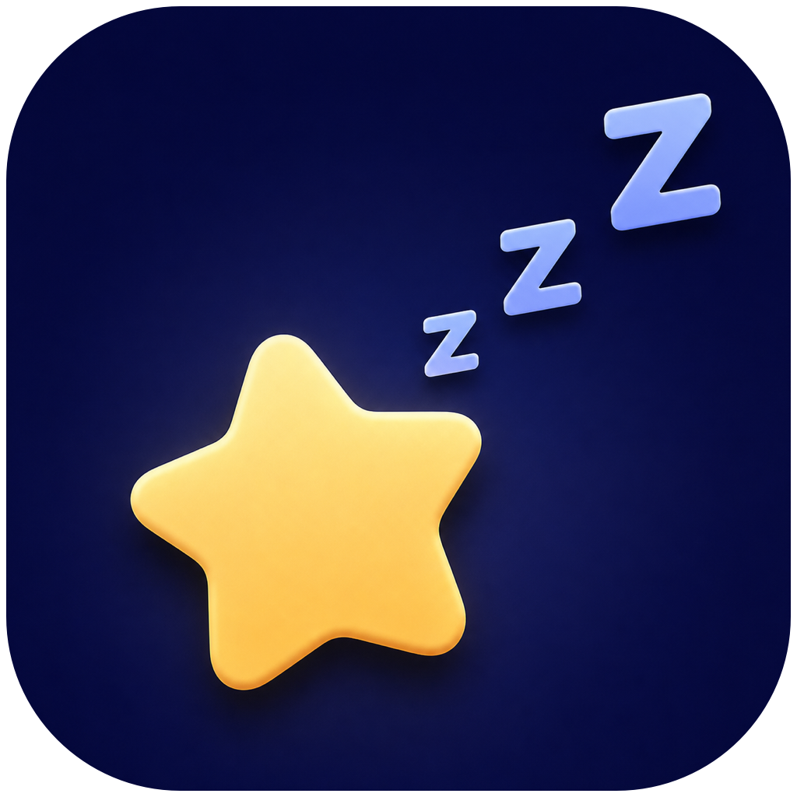

<p align="right">
  <a href="README.md">中文</a> ·
  <a href="CHANGELOG.md">Changelog</a>
</p>

<p align="center">
  
</p>

<h1 align="center">AgentAwake</h1>

<p align="center">
  Keep your agent working, then let your Mac rest as usual.
</p>

<p align="center">
  macOS 13+ · Swift · Current version 0.3.1
</p>

## About

AgentAwake is a lightweight macOS menu bar utility for long-running Codex and
Claude tasks. While a timed mode is active or an agent is working, it prevents
idle sleep with timeout-protected macOS IOKit power assertions. When the task
finishes, the timer expires, the mode is turned off, or the app quits,
AgentAwake immediately releases those assertions and returns control to macOS.

It never calls `pmset`, changes your sleep, lock-screen, or display preferences,
or keeps a persistent `caffeinate` or shell process running.

## Core features

- **One five-position slider** — Off, 30 minutes, 1 hour, 2 hours, and Agent.
  The slider is both the selector and the switch.
- **Agent-aware protection** — Detects active local Codex and Claude tasks and
  keeps the system and display awake only while work is in progress.
- **Hooks first, local logs as fallback** — Uses lifecycle Hooks for timely
  state changes. Without Hooks, it incrementally reads local task logs for a
  zero-configuration fallback instead of trusting long-lived process names.
- **Automatic release and renewal** — Agent mode uses a 120-second lease,
  renews it every 60 seconds, and releases it five seconds after the last agent
  finishes. Stale activity also expires automatically.
- **Timeout-protected power assertions** — Both timed and Agent modes use
  temporary IOKit assertions, so no permanent system setting is left behind.
- **Clear menu bar status** — Shows the current mode, countdown, waiting state,
  and active agent. Every launch starts in Off and never silently resumes the
  previous protection mode.
- **Local, lightweight, and account-free** — No network service or sign-in.
  When Off, the app does not scan for agents, keep a timer, or hold an
  assertion.

## Modes

| Mode | Behavior | Automatic end |
| --- | --- | --- |
| Off (`未开启`) | Uses the existing macOS settings; no scan, timer, or assertion | — |
| 30 minutes | Immediately keeps the system and display awake | Releases after 30 minutes and returns to Off |
| 1 hour | Immediately keeps the system and display awake | Releases after 1 hour and returns to Off |
| 2 hours | Immediately keeps the system and display awake | Releases after 2 hours and returns to Off |
| Agent | Only listens when idle; temporarily stays awake while Codex or Claude is working | Releases after the task, but remains in Agent mode to wait for the next one |

## Requirements

- macOS 13 Ventura or later
- A Swift toolchain for source builds; Xcode Command Line Tools are sufficient
- The current menu bar interface is in Simplified Chinese

## Usage

### 1. Build and launch

From the repository root:

```bash
chmod +x scripts/build-app.sh scripts/build-icon.sh
./scripts/build-app.sh
open dist/AgentAwake.app
```

The build script creates an ad-hoc signed `dist/AgentAwake.app` containing the
app icon, main executable, and Hook helpers. Once launched, AgentAwake appears
only in the menu bar and does not show a Dock icon.

### 2. Choose a protection mode

1. Click the star-and-three-`Z` icon in the menu bar.
2. Drag the slider to 30 minutes, 1 hour, 2 hours, or Agent.
3. To stop immediately, drag it back to Off (`未开启`); the temporary power
   assertions are released at once.

Timed modes start their countdown immediately. Agent mode waits without holding
an assertion, then takes over only when it detects active Codex or Claude work.

### 3. Install Agent Hooks (recommended)

Build the app first, then run the idempotent installer:

```bash
./dist/AgentAwake.app/Contents/Helpers/AgentAwakeHookSetup install
```

The installer:

- places the one-shot helper at
  `~/Library/Application Support/AgentAwake/bin/AgentAwakeHook`;
- safely merges entries into `~/.codex/hooks.json` and
  `~/.claude/settings.json`;
- creates an `.agentawake-backup` before it first changes an existing config;
- updates its own entries on repeated runs instead of appending duplicates.

Codex asks you to review unmanaged command Hooks. After installation, enter
`/hooks` in the Codex CLI, inspect the command path, and trust the new
AgentAwake Hooks. Codex skips them until they are trusted. Claude loads its
user-level settings automatically.

Agent mode still works without Hooks by using the local task-log fallback,
although state transitions may be less immediate.

To remove the adapters:

```bash
./dist/AgentAwake.app/Contents/Helpers/AgentAwakeHookSetup uninstall
```

## Verify that system settings remain unchanged

Enable a timed mode, or let Agent mode detect an active task, and run:

```bash
pmset -g assertions
```

You should see temporary `PreventUserIdleSystemSleep` and
`PreventUserIdleDisplaySleep` assertions whose names begin with `AgentAwake`.
After returning the slider to Off, those assertions should disappear.

Pause Caffeinated, Amphetamine, or similar utilities while testing; assertions
from another app make it harder to verify that sleep control has been returned.

## How agent detection works

AgentAwake does not decide activity by checking whether a `codex` or `claude`
process exists. App servers, sandboxes, and streaming processes may remain
alive long after a task has stopped.

Lifecycle events are the preferred source:

- `UserPromptSubmit` starts an activity lease;
- `PreToolUse`, `PermissionRequest`, and `PostToolUse` refresh it;
- `Stop`, Claude's `StopFailure`, and `SessionEnd` end it.

Once Hook state is available for a session, it overrides a potentially stale
transcript result. Without Hooks, AgentAwake incrementally reads local Codex and
Claude task logs. A fallback state with no new event for 30 minutes expires
automatically.

## Privacy and safety

- All detection happens locally. The app does not contact an external service
  or upload task content.
- Hook leases store only the agent type, session identifier, event name, state,
  and update time — never the prompt body.
- Local leases live in
  `~/Library/Application Support/AgentAwake/AgentActivity`.
- Quitting the app, turning the mode off, reaching the timer deadline, or
  letting a lease expire all release the power assertions.

## Development and verification

Run the dependency-free self-test:

```bash
CLANG_MODULE_CACHE_PATH=/private/tmp/agentawake-clang-cache \
SWIFT_MODULECACHE_PATH=/private/tmp/agentawake-swift-cache \
swift run --disable-sandbox AgentAwakeSelfTest
```

Regenerate the `.icns` file:

```bash
./scripts/build-icon.sh
```

Project layout:

```text
Sources/AgentAwake/          Menu bar UI and app lifecycle
Sources/AgentAwakeCore/      Protection state, agent detection, IOKit assertions
Sources/AgentAwakeHook/      One-shot lifecycle Hook helper
Sources/AgentAwakeHookSetup/ Hook installer and uninstaller
Resources/                   Info.plist and app icon
scripts/                     App and icon build scripts
```

## Current scope

AgentAwake currently targets locally running Codex and Claude tasks and is
distributed as a source build. It is not a system power-settings manager and
does not replace macOS sleep policy; it only postpones idle sleep during the
selected protection window.
